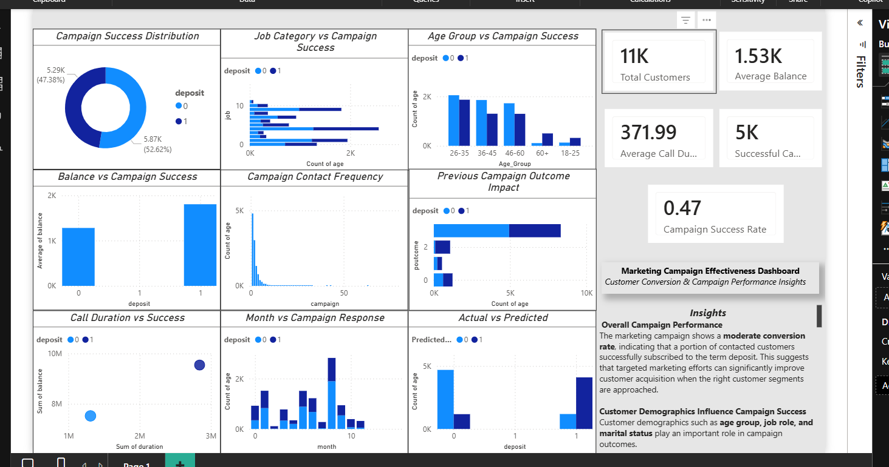

###### **Marketing Campaign Effectiveness Analysis**


###### **Problem Statement**


Banks and financial institutions run marketing campaigns to promote products like term deposits.

However, identifying which customers are more likely to respond positively is a challenge.


This project analyzes customer data to understand "what factors drive campaign success" and improve conversion rates.


###### **Dataset**


The dataset contains customer and campaign information such as:


\* Customer demographics (age, job, etc.)

\* Campaign details (contacts, previous outcomes)

\* Financial data (balance)

\* Call interactions (duration, frequency)

\* Target variable: Campaign success (deposit: Yes/No)


###### **Tools \& Technologies**


\* Python (Pandas, NumPy)

\* Data Visualization (Seaborn, Matplotlib)

\* Dashboarding (Power BI)

\* Data Analysis \& KPI Tracking

###### 

###### 

###### **Project Workflow**


**1. Data Cleaning**


&#x20;  \* Handled missing values

&#x20;  \* Removed inconsistencies


**2. Data Analysis**


&#x20;  \* Campaign success distribution

&#x20;  \* Customer segmentation analysis

&#x20;  \* Behavioral pattern identification


**3. Feature Analysis**


&#x20;  \* Age groups vs campaign success

&#x20;  \* Job category impact

&#x20;  \* Call duration and response


**4. Dashboard Creation**


&#x20;  \* Built interactive dashboard to track KPIs

&#x20;  \* Visualized campaign performance and trends


###### **Key Insights (From Dashboard)**


**1.Overall Campaign Performance**


\* Campaign success rate is "47%", indicating moderate performance

\* Out of 11K customers, 5K responded positively


**2.Customer Demographics Impact**


\* Age group 26–35 shows higher engagement and success rates

\* Certain job categories contribute more to successful conversions

\* Demographics play a key role in targeting strategy


**3.Financial Behavior**


\* Customers with higher account balances are more likely to convert

\* Balance is a strong indicator of campaign success


**4.Campaign Interaction Insights**


\* Longer call duration strongly correlates with higher success

\* Frequent contact does not always improve results (diminishing returns)


**5.Previous Campaign Influence**


\* Customers with previous successful interactions are more likely to convert again

\* Past campaign outcome is a critical predictor


**6.Time-Based Trends**


\* Certain months show higher campaign response rates

\* Timing of campaigns affects success

###### 

###### **Dashboard Preview**


(Add your screenshot here)


###### **Business Impact**


\* Enables targeted marketing for high-conversion customer segments

\* Reduces campaign costs by focusing on effective strategies

\* Improves ROI through data-driven decision making

\* Helps banks optimize call strategies and customer engagement


## 📸 Dashboard Preview



---

## 🎥 Demo Video

[Watch Demo](market_campaign.mp4)


###### **How to Run**


```bash id="run567"

pip install -r requirements.txt

python main.py

```

###### **Future Improvements**


\* Build ML model to predict campaign success

\* Implement customer segmentation (clustering)

\* Deploy dashboard for real-time monitoring

\* Integrate A/B testing for campaign strategies


###### **Author**


Thiviyesh K

Aspiring Data Analyst 


